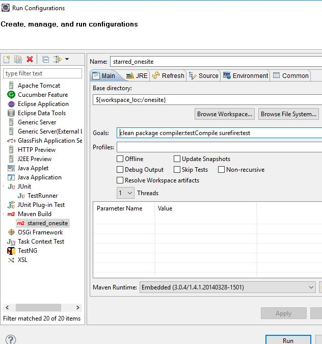

## Objective: Test cases and Test automation 

1. Navigate to the following sample application: http://computer-database.herokuapp.com/computers
2. Test CRUD operations. 
3. In this project work I have automated basic CRUD operations, and considered only positive cases.
4. This work is UI Functional testing, not a backend or webservices test automation.


What is Tested:
---------------

1. Tested on Windows 10
2. Tested positive CRUD operations.
3. Tested on Chrome browser.
4. Tested on Jenkins (local) using jenkins script (it is not full blown CI/CD). 


What is not Tested:
-------------------

1. Negative tests.
2. Not tested on Linux OS.
3. Not tested in Docker container.


Technology stack:
-----------------

1. java 8
2. cucumber
3. maven
4. selenium
5. junit 4
6. log4j 2.11
6. windows 10 OS


Open source libraries used:
---------------------------

1. junit 4
2. chromedriver
3. selenium 3.14
4. cucumber java
5. extent reports
6. log4j
    

Patterns used:
-----------------

1. page object factory from selenium.
2. singleton pattern.


Download code:
---------------

Do git clone for downloading the project to your local machine and then import project to your IDE.

Install with [git](https://git-scm.com/downloads):
	
```sh
$ git clone https://github.com/meharlist/onesite.git
```


Running test from command line:
------------------------------

1. You can use git bash or any choice of shell.

2. Go to your project directory from terminal and hit below command:

```sh
$ mvn clean package compiler:testCompile surefire:test
```

3. Test results or reports can be found in `cucumber-reports` folder which is under `target` directory.

4. `logfile` under project root, which you can open to see what steps were executed. It is simple logger info.


Running test from IDE (Eclipse):
-------------------------------

1. Import project to IDE

2. open TestRunner class from `src\test\java\com\onesite`

3. click on project root, and navigate to `src\test\java\com\onesite` and open `TestRunner` class and run as junit test

4. JUnit test results can be found in `target` folder.

5. Also, you have another option to execute from IDE.

6. you can copy mvn command, see below.

```sh
  clean package compiler:testCompile surefire:test
```

7. And go to project root folder in eclipse and click `Run As` -> `Run Configurations` and then
   double click on `maven build` and keep exactly as below image.
  

&nbsp;&nbsp;



8. click `apply` and `run`

9. test results are in `target` folder.

10. Possible issues you might encounter, java run time issue, if it is the case, do some internet search on how to execute maven project from `Eclipse IDE`

11. You might run into above issue because you did not set your `java build path` -> `JRE system library` to `jdk 8` and you forgot to set `java compiler` to `java 8`.

12. For point 11, the settings are in eclipse, navigate to project root folder and then click `build path` by left clicking and set the point 11.


Running test from Jenkins:
-------------------------------

1. Please follow this git link `https://github.com/meharlist/onesite-jenkins`
   


Do's and Don't:
--------------

1. Please do not execute in Linux OS.

2. If you try running on Linux then configuration needs changes, especially with file navigation, because linux file navigation uses `//` on contrast windows uses `\\`

3. Due to point 2 your execution will fail.

4. Don't run in `geckodriver` OR `firefoxdriver`

5. For point 4, you shouldn't be worry if you plan to run against chrome, because I have set `chrome` as browser type in `configuration.properties`.


Cucumber feature file:
----------------------

&nbsp;&nbsp;


Sample test result report:
------------------------

&nbsp;&nbsp;


Test Runner class:
------------------

&nbsp;&nbsp;


Project Structure:
------------------

&nbsp;&nbsp;


