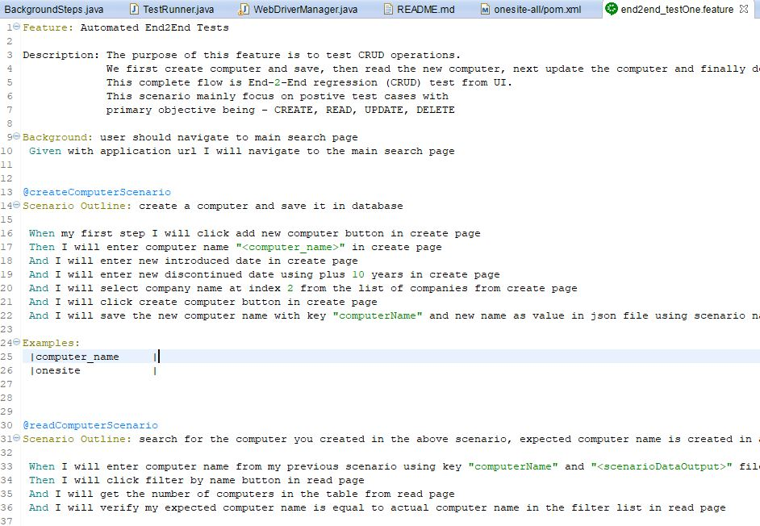
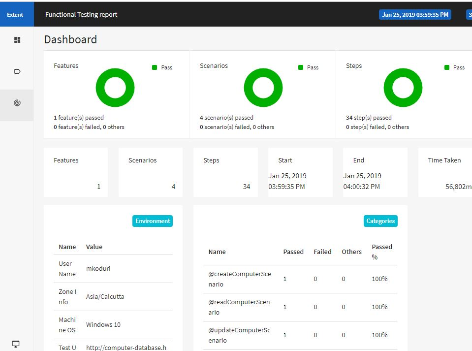
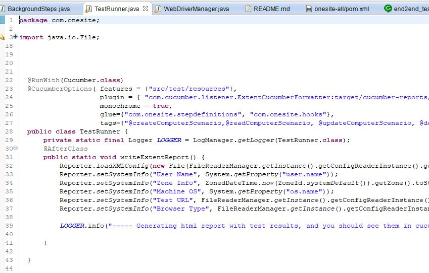
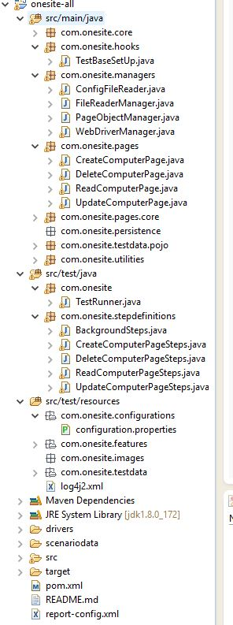

## Objective: Test cases and Test automation 

1. Navigate to the following sample application: http://computer-database.herokuapp.com/computers
2. Test CRUD operations. 
3. In this project work I have automated basic CRUD operations, and considered only positive cases.


What is Tested:
---------------

1. Tested on Windows 10
2. Tested positive CRUD operations.
3. Tested on Chrome browser.
4. Tested on Jenkins (local) using jenkins script (it is not full blown CI/CD). 


What is not Tested:
-------------------

1. Negative tests.
2. Not tested on Linux OS.
3. Not tested in Docker container.


Technology stack:
-----------------

1. java 8
2. cucumber
3. maven
4. selenium
5. junit 4
6. log4j 2.11
6. windows 10 OS


Open source libraries used:
---------------------------

1. junit 4
2. chromedriver
3. selenium 3.14
4. cucumber java
5. extent reports
6. log4j
    

Patterns used:
-----------------

1. page object factory from selenium.
2. singleton pattern.


Download code:
---------------

Do git clone for downloading the project to your local machine and then import project to your IDE.

Install with [git](https://git-scm.com/downloads):
	
```sh
$ git clone https://github.realpage.com/realpage/eqa-unifiedlogin.git
```


Running test from command line:
------------------------------

1. You can use git bash or any choice of shell.

2. Go to your project directory from terminal and hit below command:

```sh
$ mvn clean package compiler:testCompile surefire:test
```

3. Test results or reports can be found in `cucumber-reports` folder which is under `target` directory.

4. logfile under project root, which you can open to see what steps were executed. It is simple logger info.


Running test from IDE (Eclipse):
-------------------------------

1. Import project to IDE

2. open TestRunner class from `src/test/java/com/onesite`

3. click on project root, and navigate to `src\test\java\com\onesite` and open `TestRunner` class and run as junit test

4. JUnit test results can be found in `target` folder.


Running test from Jenkins:
-------------------------------

1. Go to your project directory from terminal and hit following commands

* ``


Do's and Don't:
--------------

1. Please do not execute in Linux OS.

2. If you try running on Linux then configuration needs changes, especially with file navigation, because linux file navigation uses `//` on contrast windows uses `\\`

3. Due to point 2 your execution will fail.

4. Don't run in `geckodriver`, as we seen current issue with close and quit options in firefox driver. And I haven't find alternative to this.

5. For point 4, you shouldn't be worry if you plan to run against chrome, because I have set `chrome` as browser type in `configuration.properties`.


Cucumber feature file:
----------------------

&nbsp;&nbsp;



Sample test result report:
------------------------

&nbsp;&nbsp;



Test Runner class:
------------------

&nbsp;&nbsp;



Project Structure:
------------------

&nbsp;&nbsp;



Conclusion:
-----------

1. Due to time constraint few things were (as stated above) not included or tested.
2. Given few more days I would have completed things which I haven't tested.

