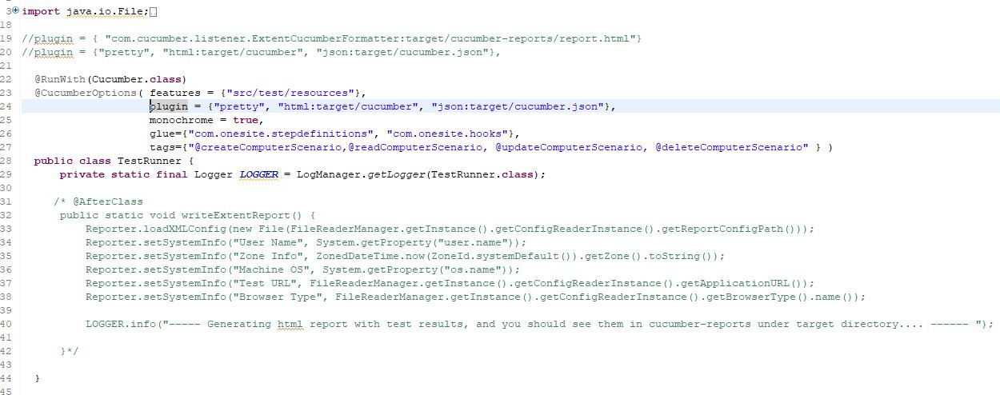
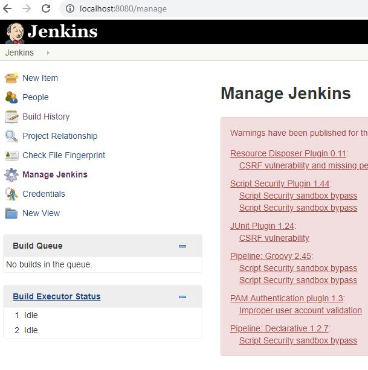
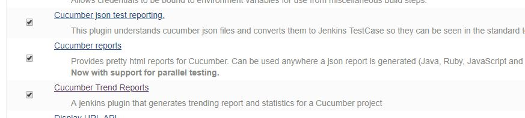
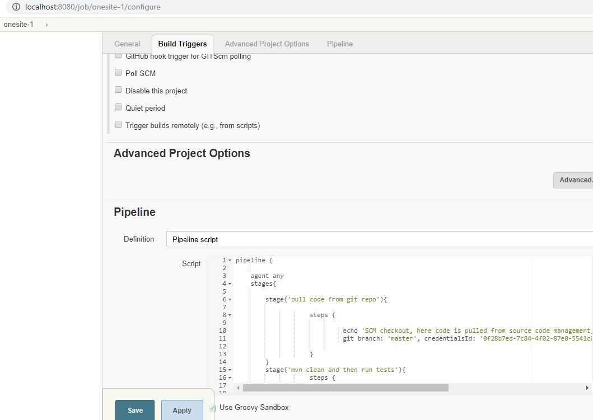
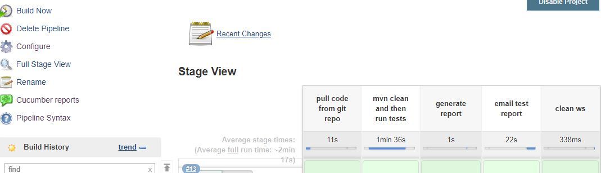
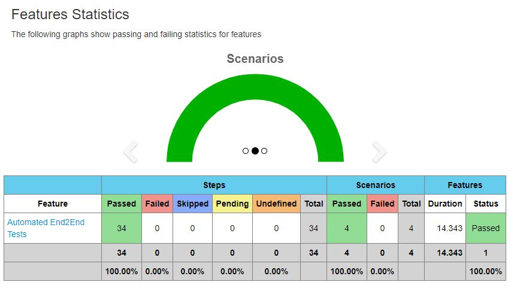

## Objective: Test cases and Test automation 

1. Navigate to the following sample application: http://computer-database.herokuapp.com/computers
2. Test CRUD operations. 
3. In this project work I have automated basic CRUD operations, and considered only positive cases.
4. This work is UI Functional testing, not a backend or webservices test automation.


What is Tested:
---------------

1. Tested on Windows 10
2. Tested positive CRUD operations.
3. Tested on Chrome browser.
4. Tested on Jenkins (local) using jenkins script (it is not full blown CI/CD). 


What is not Tested:
-------------------

1. Negative tests.
2. Not tested on Linux OS.
3. Not tested in Docker container.


Technology stack:
-----------------

1. java 8
2. cucumber
3. maven
4. selenium
5. junit 4
6. log4j 2.11
6. windows 10 OS


Open source libraries used:
---------------------------

1. junit 4
2. chromedriver
3. selenium 3.14
4. cucumber java
5. extent reports
6. log4j
    

Patterns used:
-----------------

1. page object factory from selenium.
2. singleton pattern.


Download code:
---------------

Do git clone for downloading the project to your local machine and then import project to your IDE.

Install with [git](https://git-scm.com/downloads):
	
```sh
$ git clone https://github.com/meharlist/onesite.git
```


Running test from command line:
------------------------------

1. You can use git bash or any choice of shell.

2. Go to your project directory from terminal and hit below command:

```sh
$ mvn clean package compiler:testCompile surefire:test
```

3. Test results or reports can be found in `cucumber-reports` folder which is under `target` directory.

4. `logfile` under project root, which you can open to see what steps were executed. It is simple logger info.


Running test from IDE (Eclipse):
-------------------------------

1. Import project to IDE

2. open TestRunner class from `src/test/java/com/onesite`

3. click on project root, and navigate to `src\test\java\com\onesite` and open `TestRunner` class and run as junit test

4. JUnit test results can be found in `target` folder.


Running test from Jenkins:
-------------------------------

1. First change the code in `TestRunner.java` class. please see below. 

2.   The code should look exactly as shown in below image , and this is to run in jenkins. Note, if you are running in local, please leave the code as it is.
   
&nbsp;&nbsp;

   
   
3. This was tested in my local jenkins instance using pipeline script.

4. With few tweaks you can run this project in jenkins too.

5. Please see below images and instructions to run them in jenkins.

6. install jenkins in your windows machine (this is working in windows).

7. open the instance webpage using url (`localhost:8080`)

8. create user if it is first time.

9. then you be should landed in main page of jenkins.

10. install below plugins, to have this you need to navigate to manage plugins.


&nbsp;&nbsp;


11. naviagte to manage plugins


&nbsp;&nbsp;


12. install cucumber plugins.


&nbsp;&nbsp;


13. Next, go to main page, click create new jenkins job.

14. click `Build Triggers`
  
15. select `Pipeline script` and copy the pipeline script from `pipeline_script_to_use.txt`, this file is in `src\test\resources\com\onesite\images` .

16. paste the script in `Pipeline script` section. make sure `use Groovy Sandbox` is checked, please see below image. 


&nbsp;&nbsp;



15. finally save the job.

16. to run the job, you have to click `build now`

17. you should see something like this.

&nbsp;&nbsp;



18. to see cucumber reports, click `cucumber reports` link as shown in above image.


19. this is how report looks like.

&nbsp;&nbsp;



Do's and Don't:
--------------

1. Please do not execute in Linux OS.

2. If you try running on Linux then configuration needs changes, especially with file navigation, because linux file navigation uses `//` on contrast windows uses `\\`

3. Due to point 2 your execution will fail.

4. Don't run in `geckodriver`, as we seen current issue with close and quit options in firefox driver. And I haven't find alternative to this.

5. For point 4, you shouldn't be worry if you plan to run against chrome, because I have set `chrome` as browser type in `configuration.properties`.


Cucumber feature file:
----------------------

&nbsp;&nbsp;


Sample test result report:
------------------------

&nbsp;&nbsp;


Test Runner class:
------------------

&nbsp;&nbsp;


Project Structure:
------------------

&nbsp;&nbsp;


Conclusion:
-----------

1. Due to time constraint few things were (as stated above) not included or tested.
2. Given few more days I would have completed things which I haven't tested.

